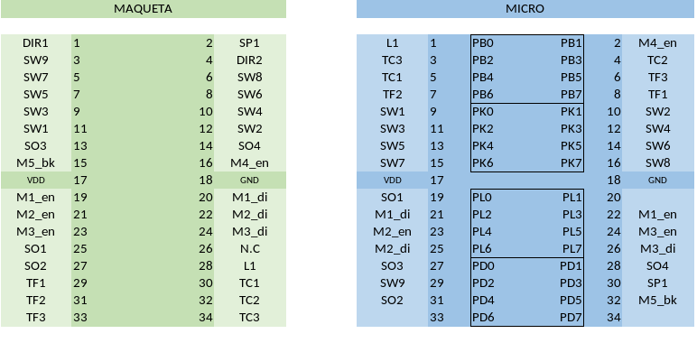
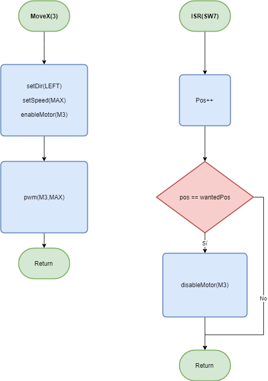

# Documentación de las librerias

## Funciones comunes:

&nbsp;

-   *max(a,b)*: devuelve el máximo

-   *min(a,b)*: devuelve el mínimo

-   *changePin(port,pin,val)*: cambia un pin de un puerto
-   *abs(a):* devuelve el valor absoluto

&nbsp;

&nbsp;

## teclado (teclado.h):

**Funciones:**

- *setup_teclado():* Inicializa el teclado

- *product_out():* función que se llama cuando no hay producto para encender LED y seleccionar de nuevo

- *choose_again():* función para dejar seleccionar si el consumidor cambia de idea.

## Sensor de monedas(coin.h):

**Funciones:**

-   *setup_coin():* Inicialización de la libreria

-   *get_saldo():* calcula el saldo

-   *get_ultima_moneda():* coge el valor de la última moneda introducida

-   *not_aligned():* Avisa de que no se debe mover al dispensador todavia

-   *substract_saldo(uint8_t gasto):* resta el saldo correspondiente(activar con piezoelectrico)

-   *syscall_aligned():* notifica al sistema de que los motores están en posición.

&nbsp;

**Interrupciones:**

-   *Sensores Ópticos 1 y 2 (SO1,SO2):*

**Llamadas externas:**

-   *moveY():* Para el dispensado y vuelve al la posición de descanso

## Control del movimiento(motion.h):

**Funciones:**

  - *void homeAll()*: hace un home para todos los ejes

  - *void homeZ()*: home vertical hacia abajo

  - *void homeX()*: home horizontal hacia la derecha

  - *void moveZ(uint16_t position)*: posicion manual del eje z, no es necesaria

  - *void moveX(uint8_t position)*: posicion manual del eje x, no es necesaria

  - *void moveY()*: activa el dispensador

  - *void stopY()*: para el dispensador y vuelve a posición de reposo

  - *void releaseProduct(uint8_t num)*: Se posiciona en el producto "num" segun la siguiente tabla:

&nbsp;

| 1 | 2 | 3 |
|---|---|---|
| 4 | 5 | 6 |
| 7 | 8 | 9 |

&nbsp;
**Interrupciones:**

- SW1 to SW6 : Endstops M1_HIGH/LOW hasta M3_HIGH/LOW (Puerto K)

- SO3 : Optical Encoder del motor M1 (vertical) (INT0)

- SO4 : Optical Encoder del motor M2 (vertical) (INT1)

- SW7 : Detector de posicion M3 (puerto K)

&nbsp;
**Llamadas externas:**

-   *syscall_product_out():* notifica al sistema que se ha agotado el producto que se ha pedido

-   *syscall_aligned():* notifica al sistema de que los motores están en posición para el dispensado

## Esquema de pines

## Explicación y flujogramas

- **Parte 1: Motores y e integración del movimiento**

El código de los motores tiene una ligera inspiración de la programación orientada a objetos: todas las variables se encuentran contenidas en structs (motor1, motor2 etc) y se implementan métodos para cambiar o consultar estos valores.

 La librería motion.c está formada por funciones de alto nivel con una sintaxis muy básica: funciones del tipo moveX(), moveY(), homeZ. Su función es evidente y su implementación muy sencilla.

El resto de librerias se encuentran en la carpeta /drivers/ y en su mayoría son funciones de bajo nivel: disableMotor(), setSpeed(), setDir(), pwm(). Esto incluye a las rutinas de interrupción (en motor.c).

La filosofía de esta parte del programa es dejar que el control del sistema lo realizen enteramente las interrupciones: por ejemplo moveX() solo pone en movimiento al motor en la dirección adecuada, mientras que la parada en el lugar adecuado deberá realizarla la rutina de interrupción de SW7. Esto hace el sistema bastante robusto debido a que las funciones son sencillas y poco vulnerables a errores. Sin embargo plantea un problema en la temporalidad de la ejecución, ya que si ejecuto moveX();moveX(); se van a mover simultáneamente. La solución es detener la ejecución de cada comando hasta que haya algun cambio en uno de los endstops, y de esto se encargan las funciones block y unblock(Que a pesar de su nombre no son bloqueantes, permiten todas las interrupciones)

Flujograma ejemplo M3:

Como ultimo comentario sobre esta parte del código también existe soporte para mover la máquina expendedora a una posición dada, incluyendo así parte de la integración. La funcion selectProduct() mueve la expendedora a la posicicion adecuada para el dispensado y avisa al sistema mediante la función syscall_alligned() (que deberá implementarse en la integración ). La función stopY() detiene el dispensado y pone a los motores en la posición de origen.
